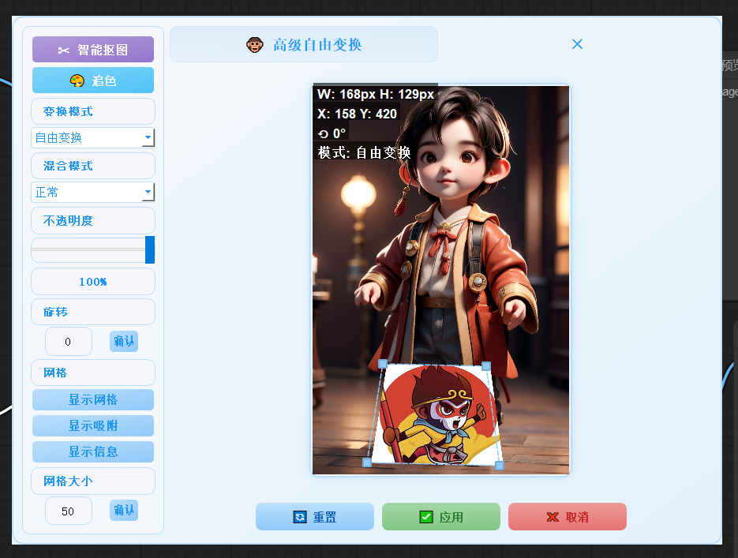
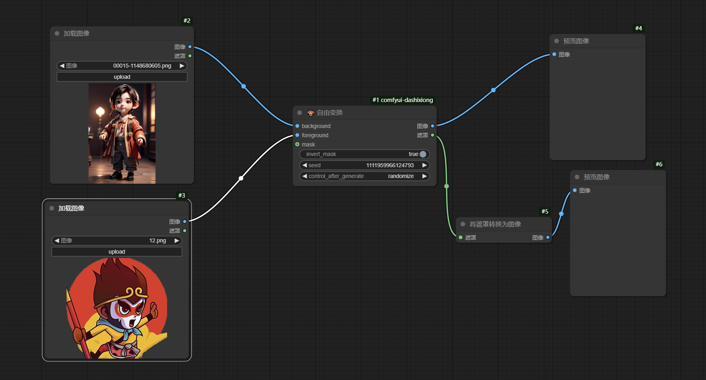
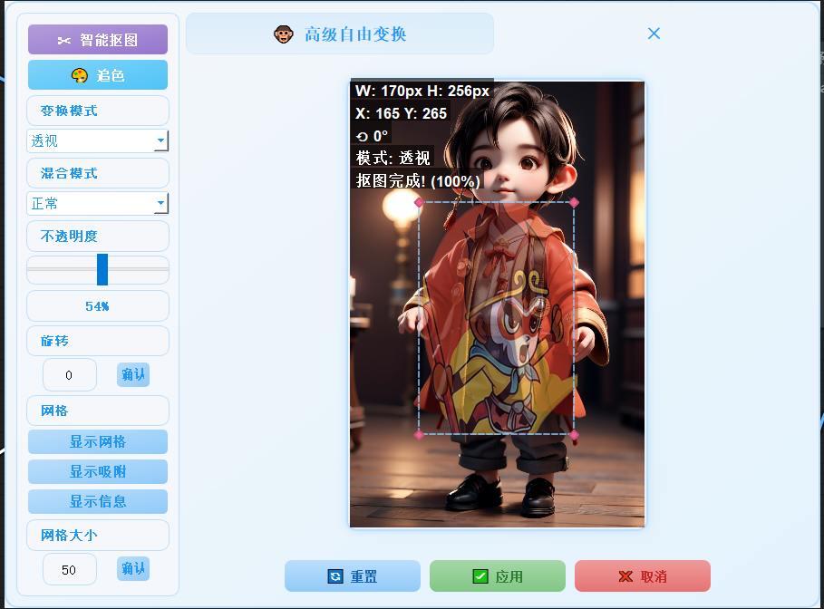
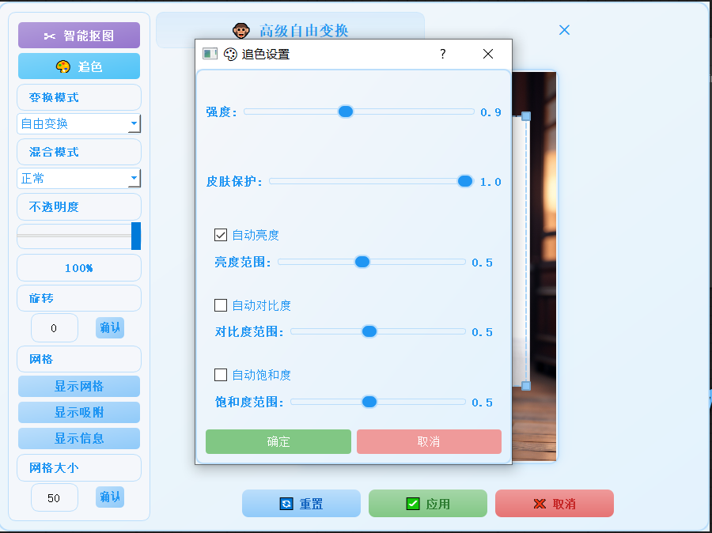
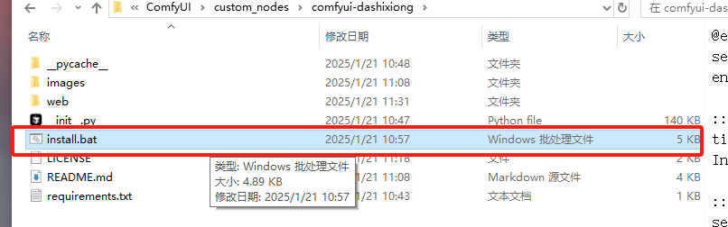
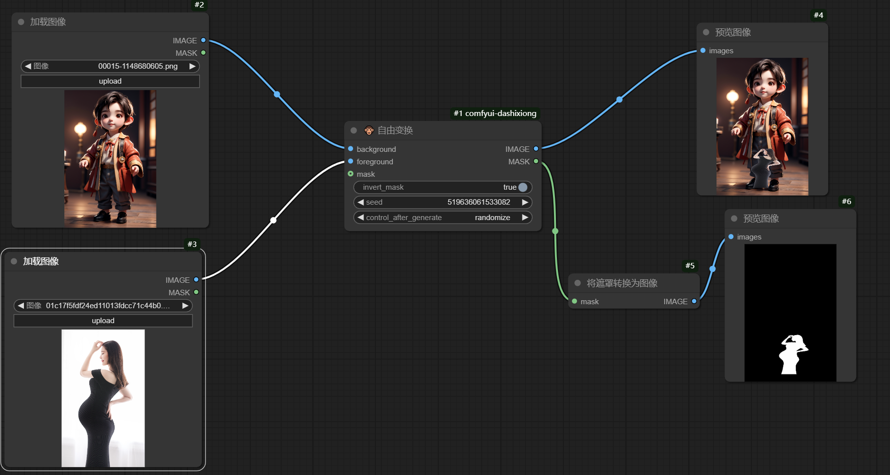

# Free Transform Plugin for ComfyUI

[English](README_EN.md) | 简体中文

需要更专业的功能可以查看 [V3版本](https://github.com/affyusc/comfyui-dashixiongv3)

## 📝 简介
Free Transform 是一个用于 ComfyUI 的高级图像变换插件，提供了灵活的图像处理功能。

## ✨ 功能特点
- 自由变换图像大小和位置
- 支持旋转和缩放操作
- 提供多种混合模式
- 实时预览效果
- 支持批量处理
- 抠图
- 追色

## 📷 效果展示

### 基础变换

    
    
基础的旋转和缩放效果

### 混合模式

    
    
不同混合模式的效果对比

### 工作流示例

    
    
在 ComfyUI 中的使用示例

### 抠图示例

    
    
在 ComfyUI 中的使用示例

### 变换模式

    
    
在 ComfyUI 中的使用示例

### 不透明度调节

    
    
在 ComfyUI 中的使用示例

### 辅助网格

    
    
在 ComfyUI 中的使用示例

### 颜色迁移

    
    
在 ComfyUI 中的使用示例

## 💻 安装方法

### 自动安装（推荐）
1. 下载插件到 ComfyUI 的 `custom_nodes` 目录
2. 双击运行 `install.bat`
3. 等待自动安装完成

    
    
安装过程示意图

### 手动安装
如果自动安装失败，您可以手动安装所需依赖：

## 📋 系统要求
- Python 3.10 或更高版本
- ComfyUI 最新版本
- Windows/Linux/MacOS

## 🚀 使用方法
1. 在 ComfyUI 工作区中找到 "Free Transform" 节点
2. 将图像输入连接到节点
3. 调整参数以获得所需效果
4. 输出处理后的图像

    
    
节点使用说明

## ⚙️ 参数说明
| 参数 | 说明 | 取值范围 |
|------|------|----------|
| Scale | 缩放比例 | 0.1-10.0 |
| Rotation | 旋转角度 | 0-360° |
| Position X/Y | 位置偏移 | 任意数值 |
| Blend Mode | 混合模式 | 多种选项 |
| Opacity | 透明度 | 0-100% |

## ❓ 常见问题

1. 安装失败

- 检查 Python 版本是否满足要求
- 尝试以管理员权限运行安装脚本
- 确保网络连接正常

2. 插件无法加载

- 确认所有依赖已正确安装
- 检查 ComfyUI 版本兼容性
- 查看 ComfyUI 日志获取详细错误信息
- 模型需要下载 grounding-dino  vitmatte  bert-base-uncased  sam 也就是抠图插件所用的模型

3. 性能问题

- 减小处理图像的尺寸
- 关闭不必要的实时预览
- 检查系统资源使用情况

## 📝 更新日志
### v1.0.0
- 初始版本发布
- 基础变换功能实现
- 自动安装脚本

### v1.1.0
- 添加新的混合模式
- 优化性能
- 修复已知问题

## 🤝 贡献指南
欢迎提交 Issues 和 Pull Requests 来改进插件。

## 📞 联系方式
如有问题或建议，请通过以下方式联系：
- 微信：xiutuxiaoliu
- Email: [1416854721@qq.com]

## 🙏 致谢
感谢所有为本项目做出贡献的开发者。

## ⚠️ 免责声明
本插件按"原样"提供，不提供任何明示或暗示的保证。使用本插件产生的任何后果由用户自行承担。
